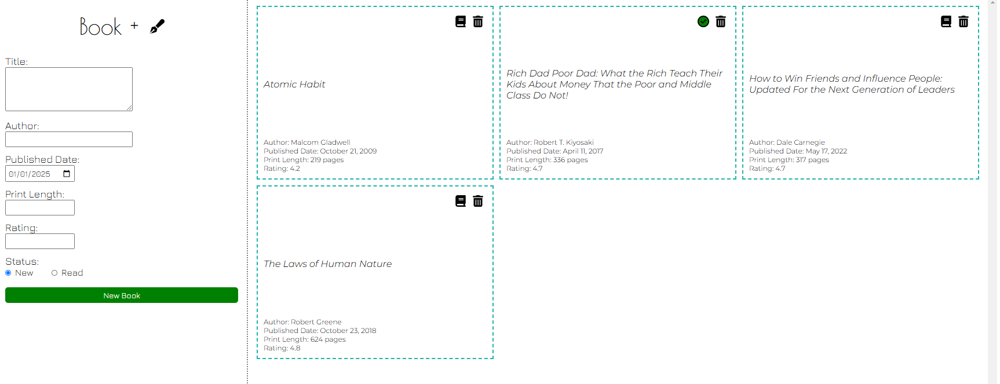

# The Odin Project: [Library](https://www.theodinproject.com/lessons/node-path-javascript-library)  

Objective:  
--> Learn the fundamental of Object & Object Constructor in JavaScript  
--> Apply JavaScript Object concept to create `Book` object and store books within `myLibrary`  

Note:  
1. Tap on the `pen` icon next to the `Book +` in the menu bar to bring up `Web Form`  
2. Fill in each detail for the book, click `New Book` button to add the book into `myLibrary`  
3. The `book` & `tick` icon at the top right corner on each card show statuses of each book.  
`book` icon represent new book while `tick` icon represent completed book.  
4. Tap on the `book` / `tick` icon to change status of the book; for example: `New` --> `Read`  
5. You can tap on the `trash` icon to remove the book from `Library`  
6. Tap on the `pen` icon again to close the `Web Form`  

  

Click [here](https://ongks-user.github.io/library/) to check out the `Library` page hosted on Github.